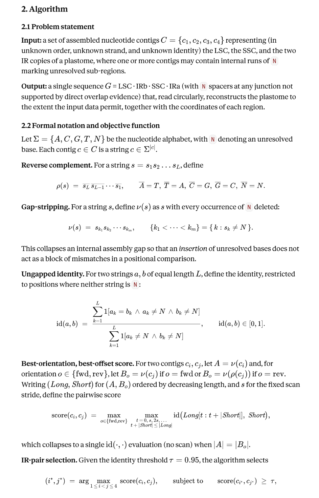
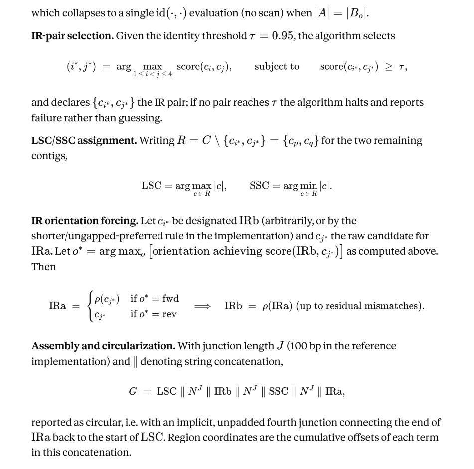

# chloromapper

Given the assembled FASTA of a chloroplast (plastid) genome, find the inverted-repeat regions (IRa/IRb) and emit a single, canonically-ordered,
end-to-end genome:

```
LSC -> IRb -> SSC -> IRa -> (back to LSC, circular)
```

`N` is only inserted where an assembly genuinely leaves a gap (stitching independently-assembled contigs together); a single well-assembled circular
contig is only **rotated**, never altered.

Zero external dependencies — builds with just `rustc`/`cargo` and the standard library.

```
chloroplast-ir — arrange an assembled chloroplast genome FASTA into the
canonical end-to-end LSC -> IRb -> SSC -> IRa order, filling N only where an
assembly gap genuinely leaves the junction unknown.

Gaurav Sablok
gsablok@proton.me

USAGE:
    chloroplast-ir --input <FASTA> --output <FASTA> [OPTIONS]

INPUT SHAPES:
    * One FASTA record  -> treated as a single already-circularized contig.
      The genome is rotated (never base-altered) to the canonical start.
    * 2+ FASTA records   -> treated as separate contigs to classify and
      stitch together (see --lsc/--ir/--ir2/--ssc to override auto-detection).

OPTIONS:
    --input <FILE>        Input FASTA (required)
    --output <FILE>        Output FASTA (required)
    --id <STRING>          Sequence id for the output record (default: derived)
    --min-len <N>           Minimum IR length to accept, bp (default: 1000)
    --kmer <N>              Seed k-mer size, <=31 (default: 21)
    --gap-n <N>             N's inserted at each inter-contig junction in
                             multi-contig mode (default: 0)
    --wrap <N>              FASTA line width, 0 = no wrap (default: 70)
    --lsc <SEQ_ID>          Force which input record is the LSC (multi-contig)
    --ir <SEQ_ID>           Force which input record is IR copy 1 (multi-contig)
    --ir2 <SEQ_ID>          Force which input record is IR copy 2 (multi-contig)
    --ssc <SEQ_ID>          Force which input record is the SSC (multi-contig)
    -h, --help              Show this help

EXIT CODES:
    0 success, 1 usage/argument error, 2 no inverted repeat could be found.

```





## Build

```bash
cargo build --release
./target/release/chloroplast-ir --help
```

## Usage

### 1. One complete circular contig (most common)

If your assembler (GetOrganelle, NOVOPlasty, Unicycler, ...) already produced
one complete circular sequence, but it starts at an arbitrary point instead
of the conventional LSC boundary:

```bash
chloroplast-ir --input assembly.fasta --output genome.fasta
```

The tool self-aligns the sequence against its own reverse complement
(k-mer seed + diagonal chaining + X-drop extension) to find the two IR
copies, works out which of the two single-copy segments is the LSC (longer)
and which is the SSC (shorter), and **rotates** the sequence to start at the
LSC boundary. No base is changed or invented.

### 2. Several separate contigs

If the assembly graph split the genome into pieces (e.g. because the repeat
collapsed the graph), pass them all in one FASTA:

```bash
chloroplast-ir --input contigs.fasta --output genome.fasta --gap-n 100
```

* If two of the contigs are (near-)reverse-complements of each other across
  most of their length, they're taken as the two IR copies automatically.
* If only 3 contigs are given and no matching pair is found, the tool
  falls back to a length heuristic (longest = LSC, shortest = SSC, middle =
  IR) — this holds for most land-plant plastomes but **is a heuristic**;
  it prints a warning when used. Override it explicitly if you know better:

  ```bash
  chloroplast-ir --input contigs.fasta --output genome.fasta \
      --lsc lsc_contig_id --ir ir_contig_id --ssc ssc_contig_id
  ```
* If only one IR copy was assembled, the second is synthesized as its exact
  reverse complement (noted in the report).
* `--gap-n <N>` inserts `N` `N`'s at each of the (up to 4) inter-contig
  junctions, since the exact junction sequence isn't recoverable from
  separately assembled contigs. Default is `0` (direct abutment).

## Options

Run `chloroplast-ir --help` for the full list (`--min-len`, `--kmer`, `--wrap`,
`--id`, per-role overrides, etc).

## How IR detection works (`src/ir_finder.rs`)

For a sequence `S` of length `n`, let `T = revcomp(S)`. If `S` contains an
inverted-repeat pair `region1`/`region2`, then `region2` is (approximately) a
substring of `T`. The finder:

1. Builds a hash index of every ACGT k-mer (default k=21) of `S`.
2. Scans `T` left to right, looking up k-mer matches and chaining hits that
   fall on the same diagonal (`i - j`) within a small gap tolerance.
3. Extends each chain in both directions with an X-drop greedy scan
   (match +1 / mismatch -2) to recover near-exact boundaries tolerant of a
   handful of SNPs/indels between the two IR copies.
4. Converts the best `T`-coordinate match back into two non-overlapping
   regions of `S`, ranks candidates by length, and drops overlapping
   duplicates.

This is linear-ish in genome size and needs no alignment library.

## Testing

```bash
cargo test
```

Unit tests build synthetic genomes (deterministic PRNG, no external data) at
both small and realistic (154 kb: 84 kb LSC / 26 kb IR / 18 kb SSC) scale,
including cases with point mutations between the two IR copies and an
arbitrary rotation to simulate an assembler starting mid-genome, and check
the recovered LSC/IR/SSC boundaries and sequence are exact.

## Known limitations

* Single-contig mode assumes the input is one **correctly assembled**
  circular molecule; it does not attempt misassembly correction.
* Labeling of which IR copy is "IRa" vs "IRb" is positional only (whichever
  comes first after LSC vs after SSC); it does not use gene annotation, so it
  may not match a reference's IRA/IRB gene-content convention.
* Multi-contig orientation of the LSC/SSC contigs themselves is assumed to
  already be correct as given; there's no automatic strand-flipping for
  those two (only the IR pairing is orientation-aware). Use future
  `--flip-*` style pre-processing (reverse-complement the FASTA record
  yourself) if a contig came out on the wrong strand.
* The 3-contig "collapsed repeat" length heuristic is a heuristic — verify
  against known chloroplast biology for unusual genomes (e.g. IR-lacking
  clades, or genomes with an SSC longer than the IR).
